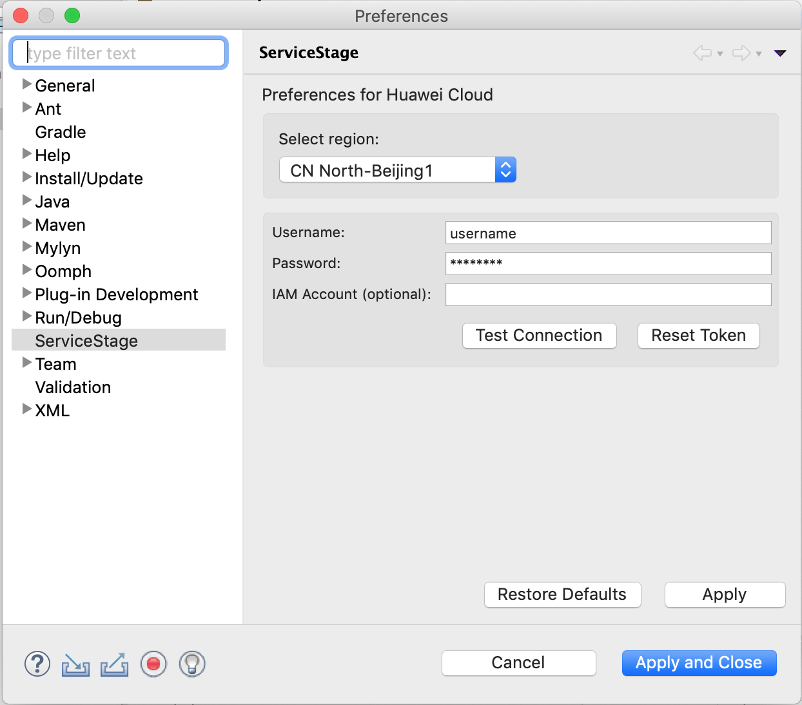
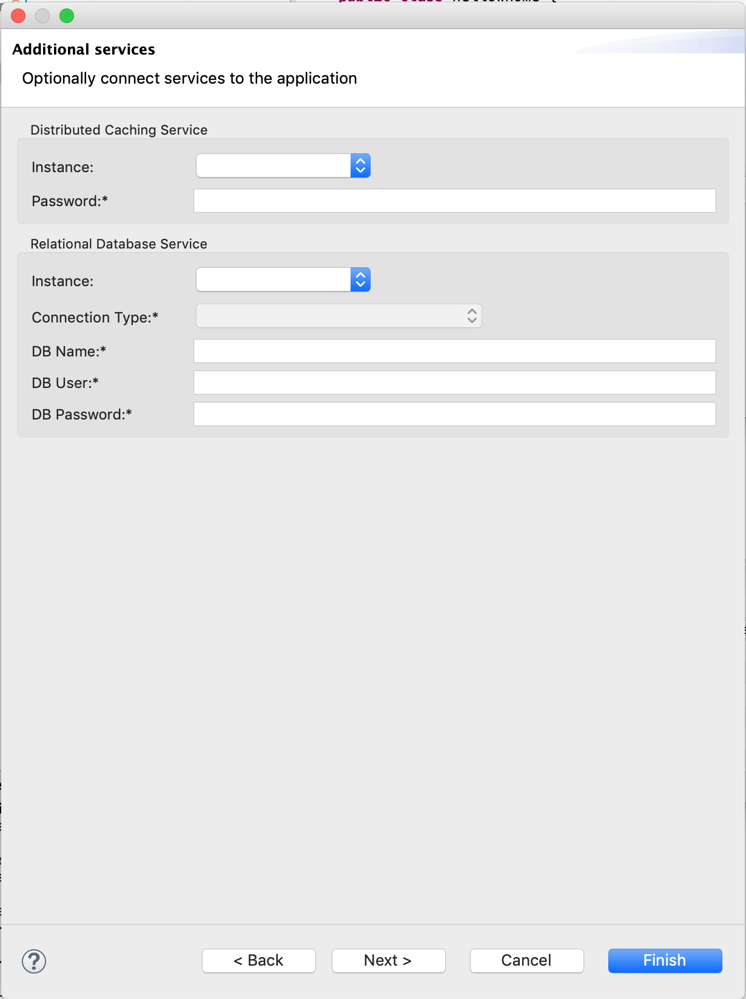

<!--
Copyright 2016 - 2018 Huawei Technologies Co., Ltd. All rights reserved.

Licensed under the Apache License, Version 2.0 (the "License");
you may not use this file except in compliance with the License.
You may obtain a copy of the License at

     http://www.apache.org/licenses/LICENSE-2.0

Unless required by applicable law or agreed to in writing, software
distributed under the License is distributed on an "AS IS" BASIS,
WITHOUT WARRANTIES OR CONDITIONS OF ANY KIND, either express or implied.
See the License for the specific language governing permissions and
limitations under the License.
-->

Eclipse ServiceStage Plugin
============================

The Eclipse ServiceStage Plugin provides simple integration with Huawei Cloud's ServiceStage service for application developers.

Features
--------
- configure application
- create application
- update application
- view application status

Installation
------------

A pre-built ServiceStage plugin jar can be found under the `servicestage-eclipse-plugin/plugins` folder. If you would like to build the plugin from the ServiceStage plugin source code, see [Build](#build) to first build and obtain the plugin jar file. 

At this moment, the plugin must be installed manually.  Once you have the ServiceStage plugin jar, place it in `${ECLIPSE_INSTALLATION}/dropins`. For example, if Eclipse is install in `/eclipse` on your system, then place the plugin jar inside `/eclipse/dropins`. Then restart Eclipse to pickup the changes.

Usage
-----

*Note:* you may use the right-click context menu, tool bar or the main menu to perform the Configure, Deploy, and Status actions. Deploy will only be visible when a war file or a Node.js project are selected.

### 1. Configure Preferences

Configure Huawei Preferences (`Window > Preferences > Huawei`)

- Select the region
- Provide username and password



The page also provides a `Reset Token` button, if you are having issues later, it may help to reset the token.

### 2. Configure Application

Now you can create your own application projects, each project in your workspace will have a different set of ServiceStage settings associated with it. These settings will be stored in `servicestage.xml` at the project root. Note: this plugin currently only supports tomcat and node.js applications.

1. Right-click the project and select `ServiceStage > Configure`
1. Fill in the application information
1. Provide the SWR repo where files will be uploaded before they can be deployed
1. Select Platform information such as Cluster ID, ELB ID, VPC ID
1. Provide information about services that your application uses
1. Click Finish. The project's `servicestage.xml` file will be created/updated




### 3. Deploy

Once your preferences and application information have been configured, you are ready to deploy your war file.

1. Build your project and generate the war file, if needed
1. From the Project Explorer, right-click the war file/Node.js project and select `ServiceStage > Deploy`
1. The deployment process will begin and provide progress information.


The deployment process is as follows:

1. The selected war file/Node.js project is uploaded to SWR
1. The application is deployed/updated to ServiceStage
1. The deployment is monitored until it completes and the application URL is provided at the end

If there is an issue with the deployment at any stage, a dialog appears showing the reason for the failure. You can also view the `Error log` view for details.

### 4. Status

You can check the status of your application at any time.

1. Right-click the project and select `ServiceStage > Status`

Build
-----

### Dependencies
The plugin has a dependency on [servicestage-client.jar](servicestage-client.jar). A copy of the file has already been included in the `./lib` directory.

If you make changes to the `servicestage-java-client` client, it must be built again. Put the [servicestage-java-client](servicestage-java-client) project in the same parent directory as this plugin project. For example:

```
workspace
├── com.huawei.cloud.servicestage.eclipse
│   ├── lib
│   └── get-dependencies.sh
└── servicestage-java-client
```

If your Eclipse workspace running within an Linux environment, you can run `get-dependencies.sh` from inside the plugin's project root directory. This will build `servicestage-client.jar` and place it under the `./lib` directory.

If your Eclipse workspace running within a Windows environment, you can run the following steps manually to compile and place `servicestage-client.jar` :

1. `mvn clean package -DskipTests -DfinalName=servicestage-client`
1. `copy .\servicestage-java-client\target\servicestage-client.jar ..\servicestage-eclipse-plugin\lib\`


### Export Plugin

1. Import the plugin project into Eclipse and make sure it builds without errors
1. Right-click the project `servicestage-eclipse-plugin` and select Export
1. Select "Plug-in Development -> Deployable plug-ins and fragments"
1. Select "Archive file" and provide the path to create the plugin output zip file (for example: service-eclipse-plugin.zip)
1. Unzip the output file to a temp folder, the plugin jar will be in the `plugins` directory

Contributing
-----------

Follow the instructions under [Build](#build) to get started.

### Formatting

Before submitting changes, make sure to format the code correctly, this will make merging code easier.

Import formatter profile:
- `Window > Preferences > Java > Code Style > Formatter`
- Click Import and Select `JavaFormatter.xml` from the project's root directory.

Next, right-click on the source packages under the project, e.g. `src/main/java` and select `Source > Format`.

License
-------

Apache 2.0. See [LICENSE.txt](LICENSE.txt).

> Licensed under the Apache License, Version 2.0 (the "License");
> you may not use this file except in compliance with the License.
> You may obtain a copy of the License at
>
>      http://www.apache.org/licenses/LICENSE-2.0
>
> Unless required by applicable law or agreed to in writing, software
> distributed under the License is distributed on an "AS IS" BASIS,
> WITHOUT WARRANTIES OR CONDITIONS OF ANY KIND, either express or implied.
> See the License for the specific language governing permissions and
> limitations under the License.
